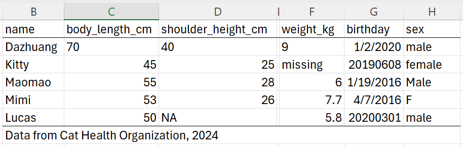

## Training lab guide

**Learning objective:** diagnose import problems before building an analysis
pipeline.

**Try this:** list which issues are data-entry problems, which are file-format
problems, and which are analysis-readiness problems.

**Watch out:** if AI writes code directly from a messy spreadsheet, it may make
the wrong assumptions silently. Always inspect the imported table before
summarizing it.

------------------------------------------------------------------------

## ❗ Common Import Issues

Even when a file opens fine in Excel, it may have issues during
analysis:

### 🚩 1. Missing Values

- Cells with `"NA"`, `"-"`, `"missing"`, `"n/a"` may not be
  automatically detected

### 🚩 2. Wrong Data Types

- Numbers stored as text: `"42 "`, `"000123"`

- Dates not recognized: `"1/2/20"` could be Jan 2 or Feb 1, depending on
  locale

- Categorical values with inconsistent spelling: `"Male"`, `"male "`,
  `"M"`

### 🚩 3. Formatting Artifacts

- Merged header cells

- Hidden rows or columns

- Extra notes at the bottom (e.g., `"Data from WHO, 2022"`)

These issues can break your cleaning pipeline or lead to **misleading
results**.

------------------------------------------------------------------------

## 🧼 Key Takeaway

- **Importing data is not just about reading the file.**

- Garbage in, garbage out.

- A careful import sets you up for **efficient, reliable analysis**.
