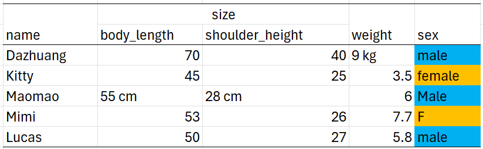
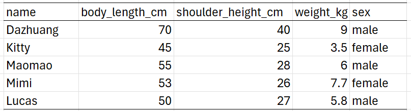

## Training lab guide

**Learning objective:** recognize whether a file is ready for analysis before
asking AI to write R code.

**Try this:** open the example dirty file, identify at least three problems, and
ask whether each problem would affect descriptive statistics, visualization, or
indicator interpretation.

**Watch out:** AI can write code that imports a file successfully while still
missing hidden rows, merged headers, text-coded numbers, or inconsistent
category labels. A successful import is not the same as clean data.

------------------------------------------------------------------------

## 🧾 What is a data table?

Tabular data: a rectangular structure made of rows and columns.

- **Each row** represents an individual record (e.g., one cat, one
  patient, one survey response)

- **Each column** represent variables or fields (e.g., age, sex, region,
  blood pressure)

Tidy data has:

- A single **header row**

- Each column with **only one type of value**

- No merged cells or sub-headers

- No extra footnotes or decorative formatting

------------------------------------------------------------------------

------------------------------------------------------------------------

## 🗃️ Common File Formats

<table>
<colgroup>
<col style="width: 22%" />
<col style="width: 31%" />
<col style="width: 22%" />
<col style="width: 23%" />
</colgroup>
<thead>
<tr>
<th>Format</th>
<th>Description</th>
<th>Pros</th>
<th>Cautions</th>
</tr>
</thead>
<tbody>
<tr>
<td><code>.csv</code></td>
<td>Comma-separated values, plain text</td>
<td>Simple, universal</td>
<td>Can’t store multiple sheets or formatting</td>
</tr>
<tr>
<td><code>.xlsx</code></td>
<td>Excel spreadsheet</td>
<td>Allows multiple sheets, formulas</td>
<td>May contain merged cells, hidden rows</td>
</tr>
<tr>
<td><code>.sav</code>, <code>.dta</code></td>
<td>SPSS/Stata files</td>
<td>Useful for surveys</td>
<td>Need special packages to read</td>
</tr>
<tr>
<td><code>.json</code>, <code>.xml</code></td>
<td>Semi-structured formats</td>
<td>Common in APIs</td>
<td>Not ready for analysis without reshaping</td>
</tr>
</tbody>
</table>
