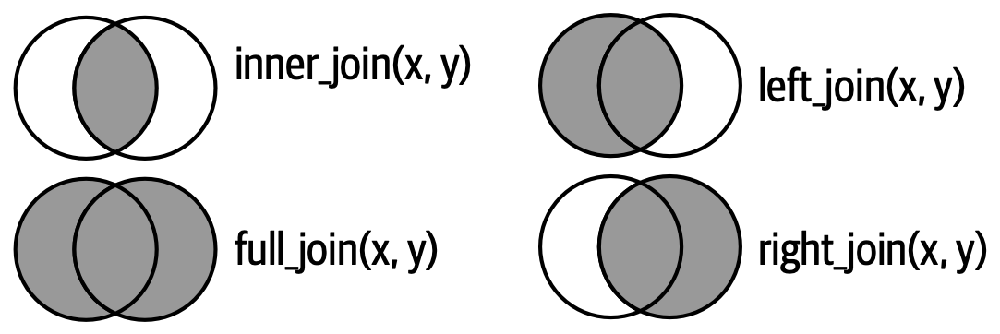

## Training lab guide

**Learning objective:** choose a join type based on the analytical question.

**Try this:** compare left join, right join, inner join, and full join on the
same two files. Check which rows are kept or lost.

**Watch out:** join choice is a substantive decision. For indicator work,
losing unmatched countries, years, facilities, or population groups can bias
the message.

------------------------------------------------------------------------

## Types of joins

Imagine we have two datasets:

- one holds 🐱cat names and breeds,

- one has 🥣cat food preferences.

<table>
<colgroup>
<col style="width: 9%" />
<col style="width: 52%" />
<col style="width: 38%" />
</colgroup>
<thead>
<tr>
<th>Join Type</th>
<th>Description</th>
<th>Example Scenario</th>
</tr>
</thead>
<tbody>
<tr>
<td><strong>INNER JOIN</strong></td>
<td>Only keeps matched rows in both tables</td>
<td>Cats that appear in both the name and diet tables</td>
</tr>
<tr>
<td><strong>LEFT JOIN</strong></td>
<td>Keep all from left, add from right when matched</td>
<td>All registered cats, with food info if known</td>
</tr>
<tr>
<td><strong>RIGHT JOIN</strong></td>
<td>Opposite of LEFT JOIN</td>
<td>All feeding records, even for mystery cats</td>
</tr>
<tr>
<td><strong>FULL JOIN</strong></td>
<td>Keep all rows from both tables</td>
<td>You don’t want to miss any cat</td>
</tr>
</tbody>
</table>

## Potential problems

- Wrong join keys = chaos.

  If you match on the wrong variable (e.g., matching on age instead of
  cat ID), you may merge cats that have the same age but are different
  cats — and that’s bad.

- Duplicates cause explosion.

  One-to-many or many-to-many joins can cause row numbers to
  unexpectedly explode.

- Different variable names? No problem.

  My dashboard allows you to select key1 and key2 to map mismatched
  column names!
