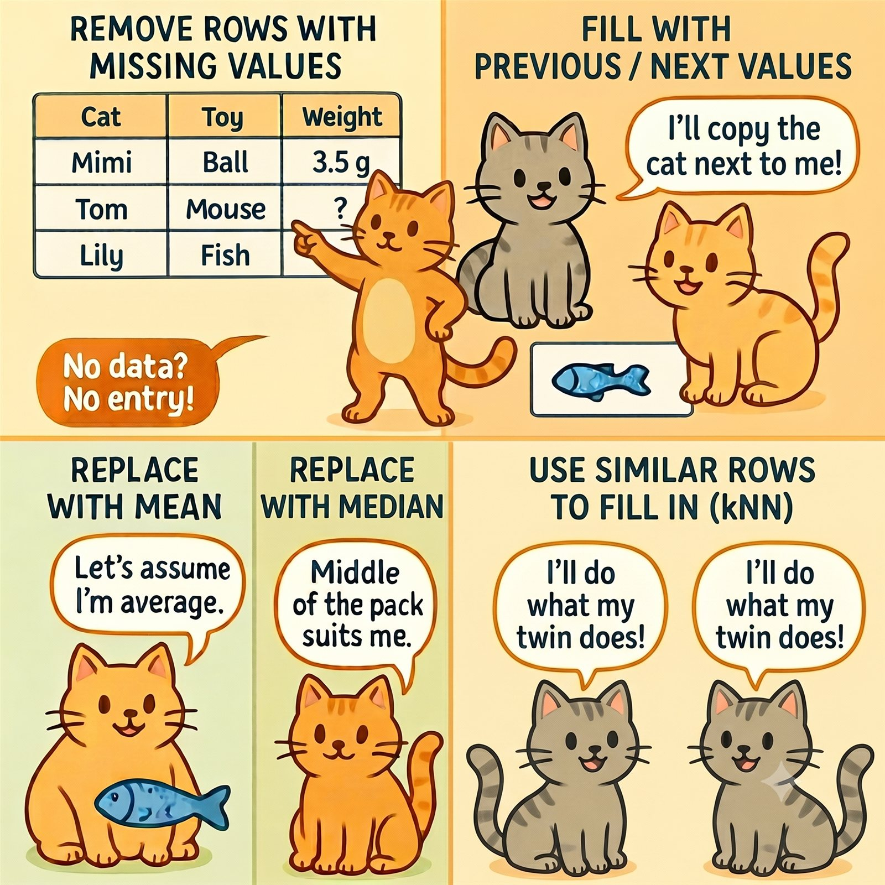

## Training lab guide

**Learning objective:** understand what each missing-data handling method
assumes.

**Try this:** apply two different methods to the same variable and compare the
summary statistics before and after cleaning.

**Watch out:** mean, median, and kNN imputation in this dashboard are teaching
examples of single imputation. For analytical work, single imputation usually
understates uncertainty. Multiple imputation, for example with `mice::mice()`,
is often more appropriate when missingness is substantial and assumptions are
defensible.

------------------------------------------------------------------------

## 🛠️ Common Handling Strategies

<table>
<colgroup>
<col style="width: 48%" />
<col style="width: 51%" />
</colgroup>
<thead>
<tr>
<th>Description</th>
<th>When to Use</th>
</tr>
</thead>
<tbody>
<tr>
<td>Remove rows with missing values</td>
<td>When missingness is rare</td>
</tr>
<tr>
<td>Fill with previous/next values</td>
<td>Time series or ordered data</td>
</tr>
<tr>
<td>Replace with mean</td>
<td>Numeric data, symmetric distribution</td>
</tr>
<tr>
<td>Replace with median</td>
<td>Skewed numeric data</td>
</tr>
<tr>
<td>Use similar rows to fill in</td>
<td>When data is rich and correlated</td>
</tr>
</tbody>
</table>

> 🐾 Tip: Always explore your missing data before choosing a method.
> Cats don’t all behave the same — neither does data!
