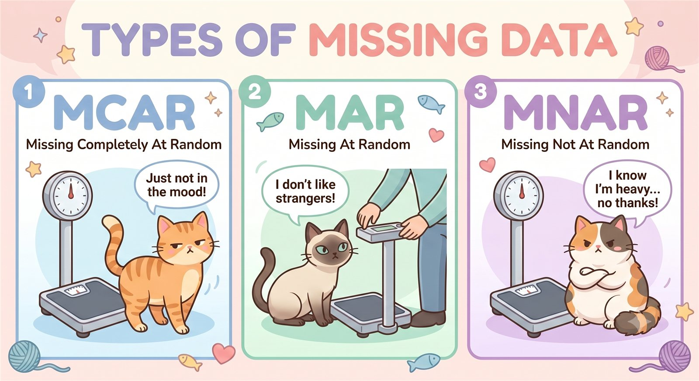

## Training lab guide

**Learning objective:** connect missingness patterns to analytical risk.

**Try this:** classify a missing-value example as MCAR, MAR, or MNAR before
choosing a handling method.

**Watch out:** the same missing-value pattern can look harmless in a table but
be highly biased in a policy indicator. Missingness is a data-generating
problem, not just a coding problem.

------------------------------------------------------------------------

## 🧩 Types of Missing Data

Not all missing data is created equal! Here are the three main types:

- **MCAR** (Missing Completely At Random):

  The cat randomly decides whether to step on the scale.

  → The missingness has nothing to do with any variable — it’s pure
  randomness.

- **MAR** (Missing At Random):

  The aloof cat refuses to be weighed.

  → The missingness is related to another variable (like personality),
  but not the missing one itself.

- **MNAR** (Missing Not At Random):

  The overweight cat refuses to be weighed.

  → The missingness is related to the value of the variable itself (in
  this case, weight).

