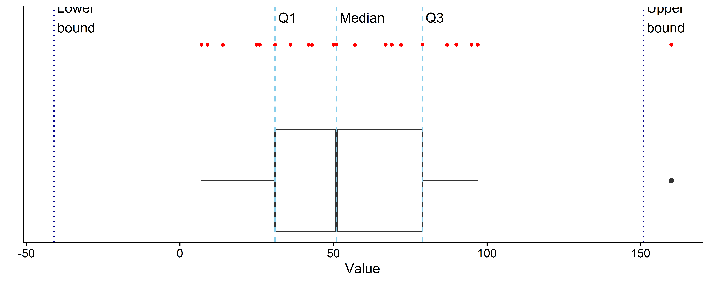

## Training lab guide

**Learning objective:** use the IQR rule as a screening tool, not as an
automatic decision rule.

**Try this:** compare the IQR rule with the actual data context. Ask whether
the flagged value is impossible, unlikely, or simply rare.

**Watch out:** univariate outlier rules can miss multivariable anomalies. A
country, facility, or respondent may look normal on each variable separately
but unusual in combination.

------------------------------------------------------------------------

## How Do We Detect Outliers?

- Boxplot Rule (IQR method)

  - IQR = Q3 - Q1

  - Lower bound = Q1 - 1.5 \* IQR

  - Upper bound = Q3 + 1.5 \* IQR

 

## Should I Remove Outliers?

- It depends!

- Data entry errors - Remove.

- Real-world extremes - Keeping or Winsorizing.

- Anomalies are meaningful (e.g., rare diseases) - Keep them! They are
  the story.
