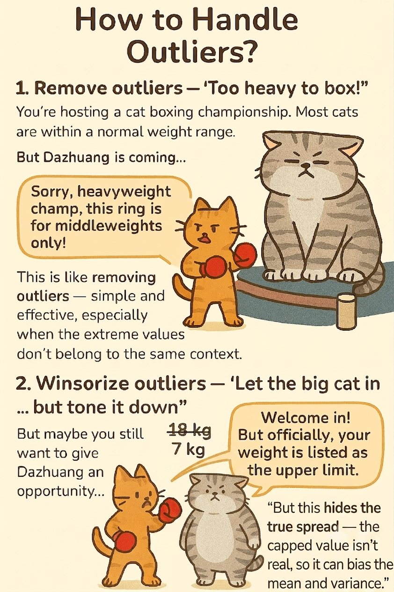

## Training lab guide

**Learning objective:** compare the consequences of removing and winsorizing
outliers.

**Try this:** apply both methods and check whether the mean, median, range, and
visual pattern change.

**Watch out:** outlier handling is an analytical decision, not a cosmetic one.
Document what you changed and why, especially if results will support a policy
brief.

------------------------------------------------------------------------

## 🛠 How to Handle Outliers?

#### 1. Remove outliers — “Too heavy to box!”

- You’re hosting a cat boxing championship. Most cats are within a
  normal weight range.

- But Dazhuang is coming…

- You decide he’s too heavy to play safely — so you disqualify him.

- **“Sorry, heavyweight champ, this ring is for middleweights only!”**

- This is like **removing outliers** — simple and effective, especially
  when the extreme values don’t belong to the same context.

- But we may lose potentially valid cases - who knows if Dazhuang is a
  boxing genius?

#### 2. Winsorize outliers - “Let the big cat in… but tone it down”

- But maybe you still want to give Dazhuang an opportunity…

- Okay, we’ll let the big cat play, but we’ll pretend he only weighs
  7kg.

- **Welcome in! But officially, your weight is listed as the upper
  limit.**

- This is like **Winsorizing** — adjusting extreme values to be less
  extreme, instead of removing them.

- But this might distort real variation - other cats will be affected a
  lot.

