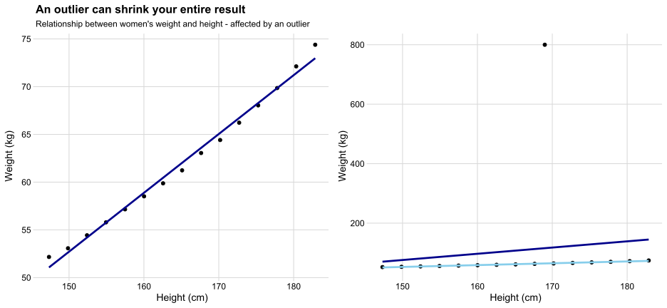

## Training lab guide

**Learning objective:** separate unusual values from incorrect values.

**Try this:** find outliers in a numeric variable, then decide whether each
outlier is a data error, a valid extreme case, or an analytically important
signal.

**Watch out:** deleting outliers only because they are inconvenient can remove
the most important part of a public health story.

------------------------------------------------------------------------

## 🚨 What Are Outliers?

- Outliers are values that stand out - they are far from the majority of
  data.

- Sometimes they are mistakes; sometimes they are just… special.

Yes, it’s an outlier

## 🌱 Why Do Outliers Matter?

- 📉 They distort averages and trends

  (One extreme value can pull the mean far away from the center.)

- 🧠 They confuse models

  (Some algorithms — like linear regression — are very sensitive to
  them.)

- 🎨 They mess with visualizations

  (One strange dot can shrink your entire scatterplot.)

