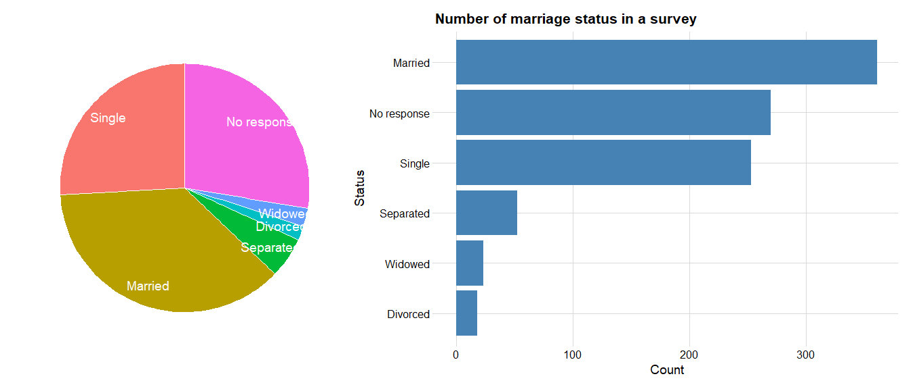
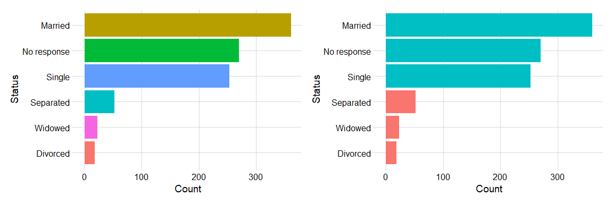
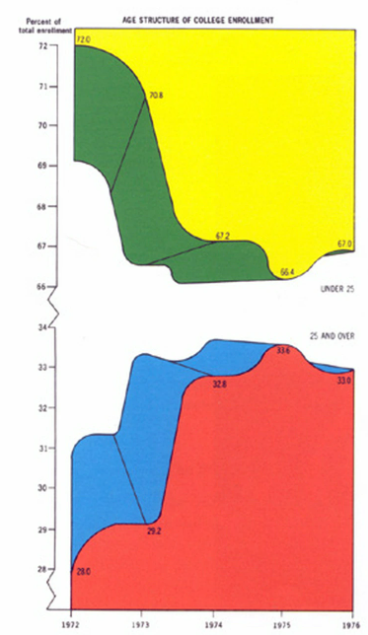
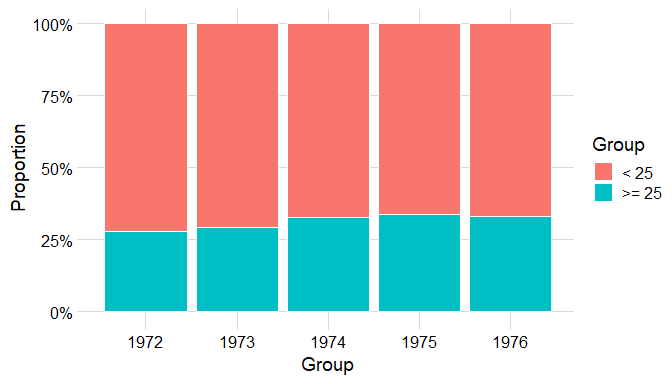
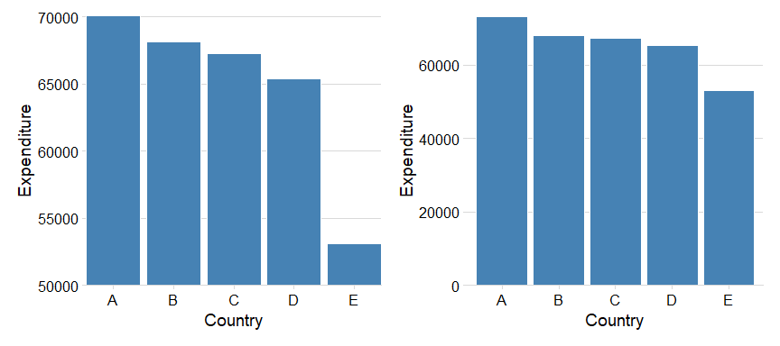

## Training lab guide

**Learning objective:** critique whether a visualization communicates fairly.

**Try this:** identify one chart design choice that improves clarity and one
choice that could mislead the audience.

**Watch out:** for policy communication, clarity is an ethical issue. Avoid
visual choices that exaggerate differences, hide denominators, or imply
causality from correlation.

------------------------------------------------------------------------

## Principles of data visualization

Which graphs should I be using?

As a general rule of thumb:

- Bar charts are for showing the relationship between 1 categorical
  variable (e.g. color, car model, gender) against 1 numerical variable
  (height, test scores, IQ and other measurements).

- Pie charts are for the same thing, but aren’t very good for data that
  contains more than 2-3 categories. E.g. it’s fine for gender since it
  only has male, female and other, but it’s terrible for listing all car
  models.

- Scatterplots are for finding correlations between 2 numerical
  variables.

- Time series are for showing changes over time (time vs. numerical
  variable).

**Some bad examples:**

### 1. Pie chart with too many categories

- Pie charts are best used when there are 2-3 items that make up a
  whole.

- It’s difficult for the human eye to distinguish between the parts of a
  circle.

- Notice how it’s hard to distinguish the size of these parts.

### 2. Ink-ratio principle

- Maximize data-ink, minimize non-data-ink. Only use ink that
  communicates data; remove unnecessary visual elements.

- Avoid chartjunk. Decorative elements like 3D effects, excessive
  gridlines, or shadows often distract from the data.

- Simplify without sacrificing clarity. A clean design often improves
  readability and interpretability.

- Use minimalist design to emphasize patterns. Less ink allows trends
  and anomalies to stand out more clearly.

- Apply to all visual forms. Whether line, bar, or scatter plots, this
  principle encourages clarity and efficiency in all graphics.

Let’s see a worst graph and its comparison:

### 3. Charts that don’t start at zero (misleading)

- Always remember: bar charts should start from zero.

- Bars represent quantity through length. If you truncate the y-axis, it
  visually exaggerates differences.

- Always start bar charts at zero to avoid misleading the
  audience—especially when comparing magnitudes.
