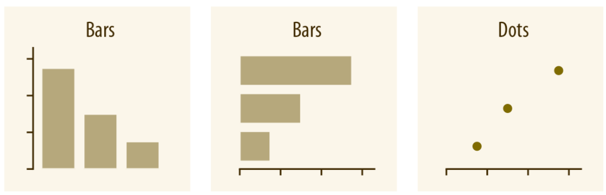
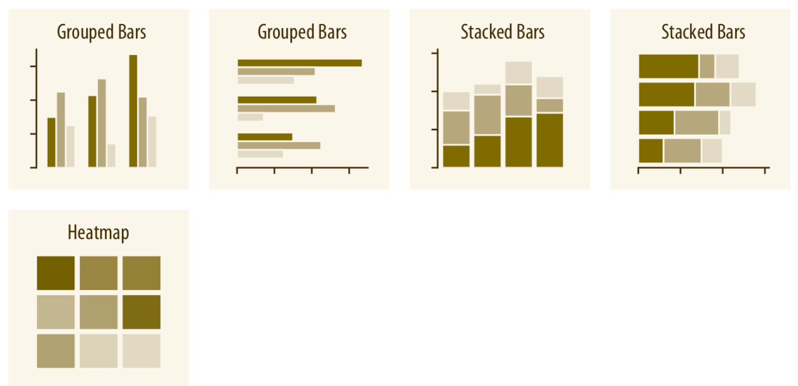
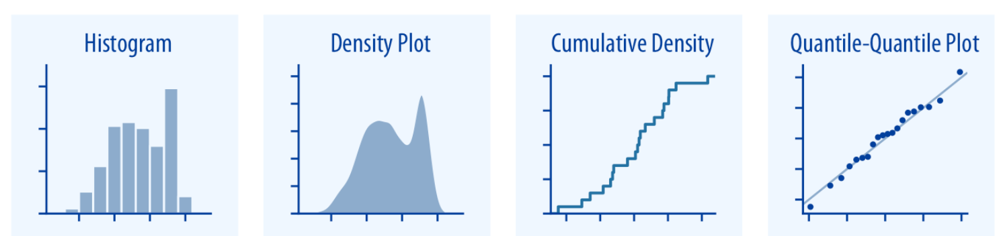
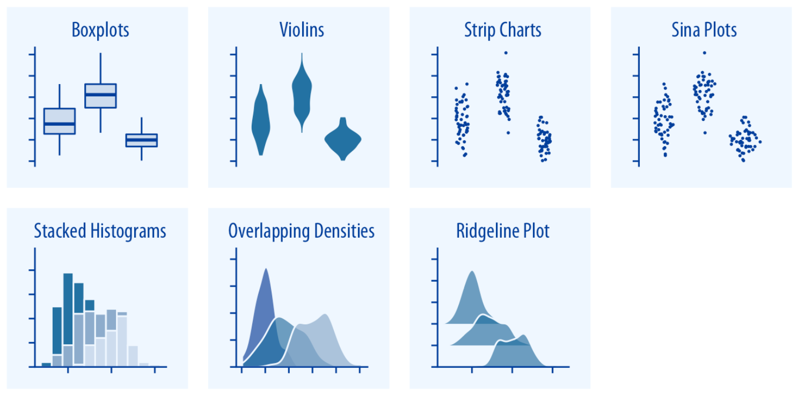
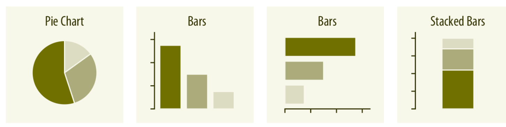
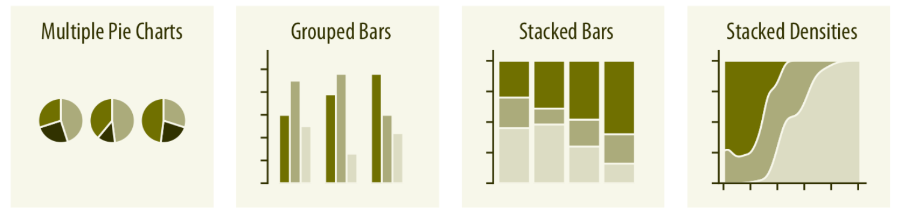
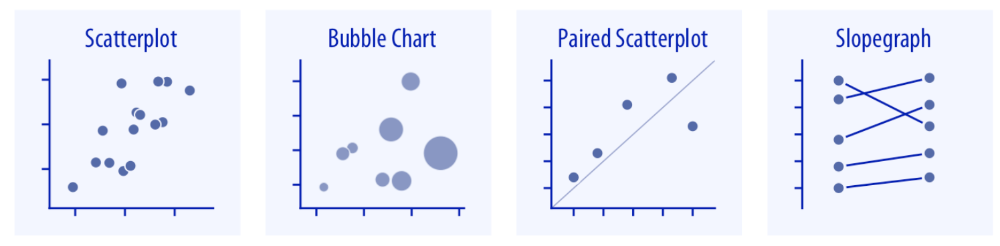
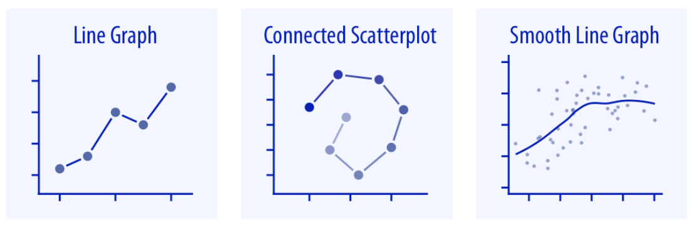

## Training lab guide

**Learning objective:** choose charts based on variable type and analytical
question.

**Try this:** write the question first, identify the variable types, then pick
the chart. Do not start by choosing a chart because it looks impressive.

**Watch out:** AI-generated chart code often produces a plot that runs, but not
necessarily the plot that answers the question.

------------------------------------------------------------------------

## 📊 Common Chart Types and Use Cases

### 1. Amounts

- Single categorical variable: bars or dots.

- Use bars when you want to show clear differences in magnitude.

- Use dots when focusing on exact values or when screen space is
  limited.

- Always sort your categories if ranking is part of the message.

- Two or more categorical variables: grouped or staked bars, or heatmap.

- Grouped Bar Charts allow you to compare sub-groups side by side within
  each main category.

- Stacked Bar Charts show the total per category while allowing
  comparison of relative sub-group sizes.

- Heatmaps are useful when both variables have many levels, making bar
  charts visually cluttered.

### 2. Distributions

- Single numeric variable: histogram, density plot.

- A histogram breaks the range of a continuous variable into intervals
  (bins) and shows the count of observations in each bin.

- A density Plot is a smoothed version of the histogram, and shows the
  relative likelihood of values,

- More than one numeric variables: boxplot.

- Sometimes, we want to understand how a continuous variable is
  distributed across multiple categories. A boxplot is one of the most
  powerful and widely used tools for this.

### 3. Proportions

- Single categorical variable: pie charts, bars, stacked bars.

- Pie Charts show parts of a whole as slices in a circle. It is popular
  but often criticized for being visually imprecise.

- More than one variables: multiple pie charts, stacked bars.

- Multiple Pie Charts: Each pie representing the composition of a
  different group. Useful for showing within-group composition. But
  cross-group comparison is difficult.

- Stacked Bar Charts: Each bar represents a group, segmented by category
  to reflect internal composition. Each bar represents 100%. But only
  the top and bottom segments share a common baseline, making it harder
  to compare mid segments accurately.

### 4. Associations Between Variables

- Relationships between numeric variables: scatterplot, bubble chart.

- Scatterplot: Each point represents a single observation with two
  numeric variables. Can be enhanced with trend lines (e.g.,
  regression), color coding by category, or marginal distributions.

- Bubble Chart: A variation of the scatterplot where a third numeric
  variable is mapped to the size of each point. Best for showing
  multivariate relationships in small to medium-sized datasets.

- Visualize how a variable changes across time or another ordered
  dimension: line chart.

- Line Graph: Plots a continuous variable (usually time) on the x-axis,
  with a value on the y-axis. Suitable for showing trends over days,
  months, years, etc.

- Smooth Line Graph: shows how a variable changes, but instead of
  connecting raw data points with straight lines, it uses a smoothed
  curve to highlight the overall trend. Reduces noise in the data by
  fitting a smooth curve
