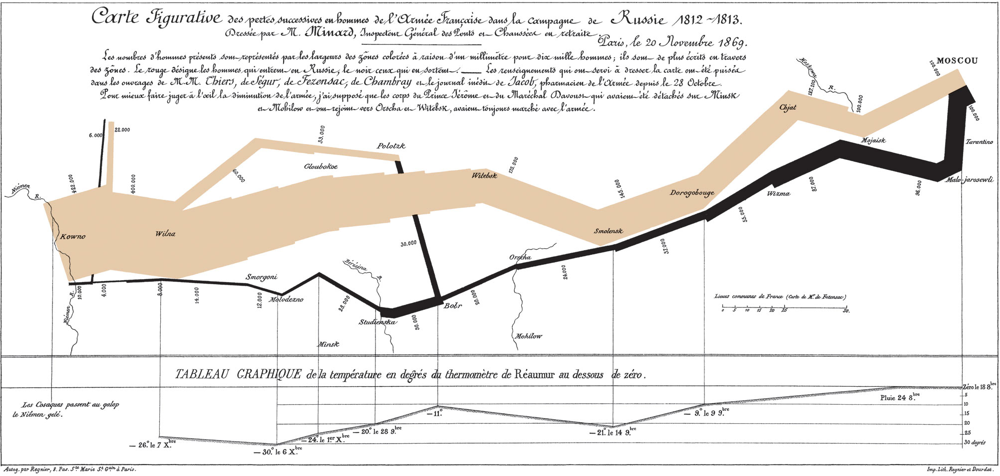

## Training lab guide

**Learning objective:** use visualization to support interpretation, not just
to decorate an analysis.

**Try this:** create one chart for exploration and one chart for communication.
Ask whether the chart changes what a decision-maker would notice.

**Watch out:** a chart can be technically correct but still misleading if it
hides uncertainty, confounding, denominator issues, or data quality problems.

------------------------------------------------------------------------

## 📌 Visualization Overview

### A Picture is Worth a Thousand Words

Data visualization is not just a tool for displaying results — it’s a
way of thinking. Effective visualization helps us:

- Detect patterns

- Reveal outliers

- Enhance communication

- Support decision-making

A well-crafted chart can speak more powerfully than pages of text.

### 📍 Minard’s Map of Napoleon’s Russian Campaign (1869)

- Charles Minard visualized six dimensions (army size, geography, time,
  temperature, direction, battles) in a single chart, showing Napoleon’s
  catastrophic 1812 war of Russia.

- From 422,000 soldiers marching east to only 10,000 returning — a
  powerful story told visually.

### 🩺 Florence Nightingale’s Rose Diagram (1858)

- Florence Nightingale used this chart to highlight how preventable
  diseases — not battles — were the main cause of death during the
  Crimean War.

- 👉 Her visual argument convinced British Parliament to reform military
  healthcare, saving countless lives.
