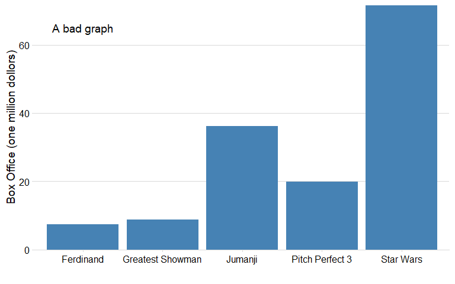
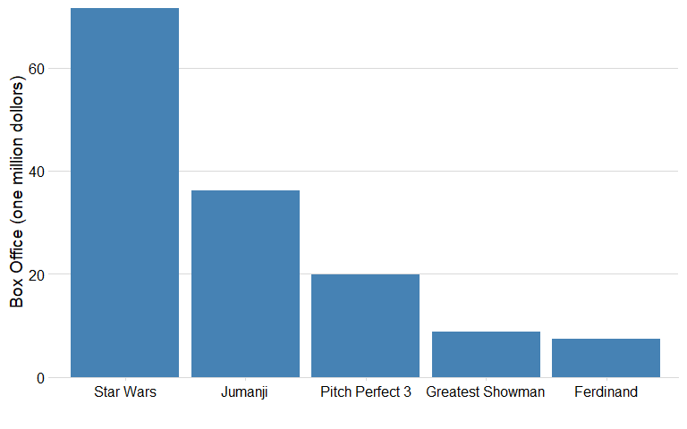
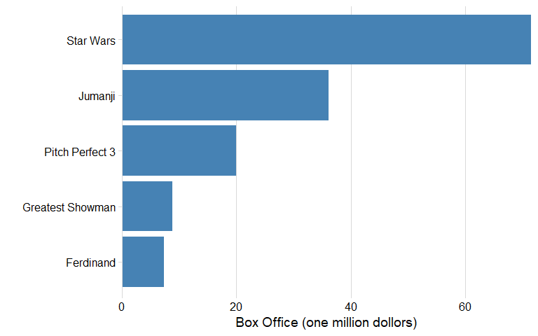
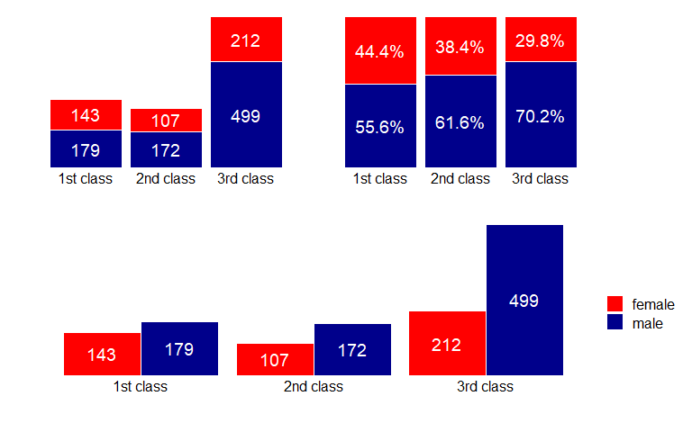

## Principles of bar charts

    ## Warning: The `file` argument of `read_csv()` should use
    ## `I()` for literal data as of readr 2.2.0.
    ##   
    ##   # Bad (for example):
    ##   read_csv("x,y\n1,2")
    ##   
    ##   # Good:
    ##   read_csv(I("x,y\n1,2"))
    ## This warning is displayed once per session.
    ## Call `lifecycle::last_lifecycle_warnings()` to
    ## see where this warning was generated.

### 🚫 Common Pitfall: Unsorted or Hard-to-Read Bar Charts

Bar charts are one of the most common and effective visualization
tools—but they can be confusing or misleading if not properly
constructed.

In the figure above, the leftmost chart is a bad example:

- The bars are not sorted by value.

- It forces the viewer to jump back and forth to identify the highest
  and lowest values.

- The message is unclear at first glance.

The middle chart is better:

- The bars are now sorted from highest to lowest.

- This makes it easier to see the ranking of categories and compare
  their values.

The rightmost chart takes it one step further:

- By rotating to a horizontal bar chart, it improves label readability,
  especially when category names are long.

- This format is often preferable when you have many categories or long
  text labels.

✅ Best Practice:

- Always sort bars from highest to lowest (or vice versa) unless there’s
  a logical or temporal reason not to.

- Consider using horizontal bars when labels are long or numerous.

### 📊 Three types of multiple groups in bar charts

When visualizing categorical comparisons across groups, bar charts can
use different positioning strategies. Below are the three main types:

- Stacked bar chart

  - Bars are stacked on top of each other.

  - Shows the total count per group while preserving each subgroup’s
    contribution.

  - Useful for emphasizing overall quantity and composition.

- Filled bar chart

  - Bars are stacked and normalized to the same height (100%).

  - Shows the proportion of each subgroup within each group.

  - Excellent for comparing percentages or distributions across groups.

- Dodged bar chart

  - Bars for each subgroup are placed side by side.

  - Makes it easy to compare subgroup values directly within and across
    groups.

  - Best for raw count comparison between categories.
