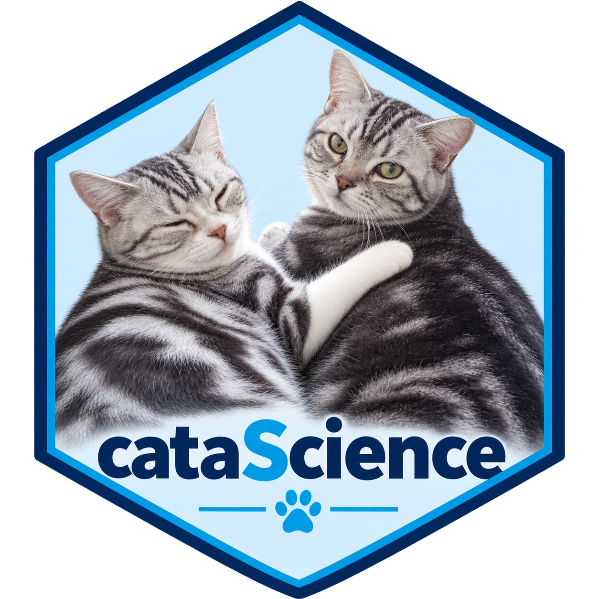

```{r, include=FALSE}
knitr::opts_chunk$set(collapse = TRUE, comment = "#>", message = FALSE,
                     warning = FALSE, fig.width = 7.2, fig.height = 4.5)
```

```{r setup}
library(cataScience)
```



cataScience can be the teaching surface for a facilitated session or a
self-study course. Choose modules for the audience and available time, use
the app for demonstrations, and let participants practise on their own
copy. This guide adapts the playbook and lab material bundled with the app.

## Match the modules to a learning goal

| Goal | Suggested modules | Evidence of learning |
|---|---|---|
| Inspect a dataset before analysis | Import; Missing data; Outliers | Explain a data problem and one defensible response |
| Communicate a finding | Visualize; Describing data | Choose a chart and state its denominator and limits |
| Understand a statistical comparison | Normal distribution; t-test; Regression | State assumptions and distinguish association from causation |
| Work effectively with an AI assistant | Prompting levels; Prompt gallery | Produce a clear task with context, output and checks |
| Review an AI-generated analysis | AI-assisted analysis; When AI gets it wrong | Identify a claim to keep, revise or remove |

The suggested times below are planning aids from the bundled playbook.
Adjust them for group size, prior experience and connectivity.

## A three-hour data science session

| Start | Activity | Format |
|---|---|---|
| 00:00 | Home: the workflow and the purpose of analysis | Short introduction |
| 00:15 | Import: load the cat data and inspect the preview | Hands-on |
| 00:40 | Missing data: compare two cleaning choices | Hands-on and discussion |
| 01:05 | Outliers: error, rare value or useful signal? | Hands-on and discussion |
| 01:30 | Break | Break |
| 01:40 | Visualize: compare a chart before and after cleaning | Hands-on |
| 02:10 | AI-assisted analysis and a critique activity | Group work |
| 02:40 | Quiz with the covered topics selected | Knowledge check |
| 02:55 | Take-home decisions and questions | Wrap-up |

For the cleaning activity, use
[A guided data-quality workflow](data-quality-workflow.html). Keep the
cat dataset as the main exercise; reserve indicator datasets for a short
extension once learners understand the workflow.

## A two-hour AI session

| Start | Activity | Format |
|---|---|---|
| 00:00 | Home: purpose, roles and expectations | Introduction |
| 00:10 | AI → Prompting levels | Demonstration and a short exercise |
| 00:35 | AI → Prompt gallery: adapt three or four prompts | Live demonstrations and practice |
| 01:15 | AI → When AI gets it wrong | Case study and discussion |
| 01:30 | AI → AI safety | Discussion of the bundled guidance |
| 01:40 | Quiz on the covered AI topics, followed by questions | Knowledge check |

For a full day, combine the data science session in the morning with the AI
session in the afternoon. Use selected Statistics pages as a bridge and
finish with the methods case study and quiz.

## Prepare the room and computers

Choose a distribution route before sending instructions:

| Edition | Participant requirement | Preparation |
|---|---|---|
| R package | R, package dependencies and a browser; RStudio is useful | Install cataScience before the session and test run_cata() |
| Portable Windows edition | A compatible Windows computer; supplied separately by the maintainer | Extract the whole archive to a short local path and test its launcher |

The portable edition is a separate distribution. Installing the R package
does not create a portable executable.

For the package edition, send these commands before the session:

```{r preparation, eval=FALSE}
install.packages("cataScience")
library(cataScience)
run_cata()
```

Then check that learners can load the example data, view a chart and open
the quiz. On your projector, test text size and browser zoom. Keep a backup
copy of the exercise files from the Home page's **Download datasets** link.

The bundled data activities and lessons run offline. External AI
demonstrations need internet and an AI account. If connectivity is weak,
use a prepared example for discussion and the worked examples on the
Prompting levels page.

## Facilitate a 20–30 minute lab

| Minutes | Activity | Instructor prompt |
|---|---|---|
| 0–3 | Frame the task | What should we check before asking for a summary? |
| 3–8 | Import and inspect | What does one row represent, and where are the gaps? |
| 8–15 | Compare missing-data choices | Which assumption makes this choice reasonable? |
| 15–22 | Investigate outliers | Is this value wrong, rare or important? |
| 22–27 | Compare a chart | Did the sample, distribution or message change? |
| 27–30 | Debrief | Which decision must be recorded before using this result? |

Demonstrate a small task, give participants time to repeat it, then discuss
what changed. Use **Reset to original data** when comparing alternatives.
Avoid applying several cleaning actions without checking the intermediate
result.

Mean or median replacement is useful for demonstrating the consequences of
a choice. Explain that single imputation reduces apparent variability;
multiple imputation may be more appropriate for an analytical project.

## Practise a prompt with explicit checks

Ask learners to adapt this task to a non-sensitive example dataset:

> Inspect the attached dataset before analysing it. State what one row
> represents, list the variables and units, and check missing values,
> duplicate identifiers and unusual observations. Propose a short
> descriptive analysis in R. Explain each cleaning choice and ask me before
> changing the original data. Return a table of findings and a list of
> decisions that still need human review.

Review whether the assistant followed the task and whether its checks
are correct. If the analysis involves an indicator, supply and verify
the current definition and methodology rather than relying on the
assistant's recollection.

## Critique an AI-generated analysis

Use a short prepared analysis with visible claims, charts and methods.
Give each group three labels: **Keep**, **Revise** and **Remove**. Ask them
to justify at least one decision in each category.

| Area | Questions to review |
|---|---|
| Data and indicator fit | Are definition, units, year, geography, population and denominator clear? |
| Data quality | Were missing values, duplicates and outliers investigated? |
| Descriptive claims | Do the summaries and charts match the variable type and question? |
| Causal language | Does the analysis confuse association with causation or ignore alternative explanations? |
| Context | Could coverage, definitions or reporting practices differ across groups or years? |
| Communication | Does the conclusion follow from the evidence, with the relevant limitations stated? |

Finish with a two-sentence message: what the evidence suggests, and what
decision or further check it supports. The goal is a useful, defensible
interpretation, rather than merely finding coding errors.

The complete lab script and critique checklist are included in the
**AI-assisted analysis** teaching material. The **Training → Training
guide** page contains the original playbook.

## Use the quiz to support discussion

Select the topics covered during the session and click **Apply topics and
restart**. Applying the filter starts a new quiz and resets its score.
Discuss the explanations after learners answer, especially where different
groups made different cleaning decisions.

Use the final exercise only after checking that learners understand the
indicator dataset's geography, years, units and method. A simple regional
mean is a descriptive summary of the included countries; it is not
automatically a population-weighted regional estimate.

## Close with an analysis record

Ask participants to keep the original exercise file and a short note on:

- the question and population or observations;
- each cleaning decision and its reason;
- the chart or summary they chose;
- any AI assistance and how it was checked;
- unresolved limitations and the next useful check.

```{r package-version}
packageVersion("cataScience")
```

For a self-study learner, follow the same sequence with a shorter module
selection and use the quiz explanations as a review. For support, contact
the maintainer through the
[cataScience repository](https://github.com/shanlong-who/cataScience).
